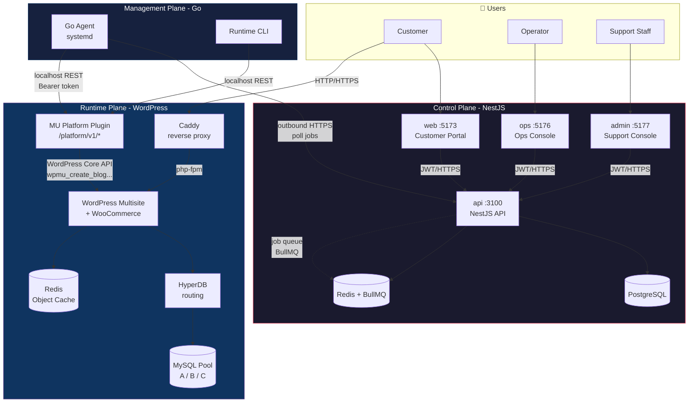
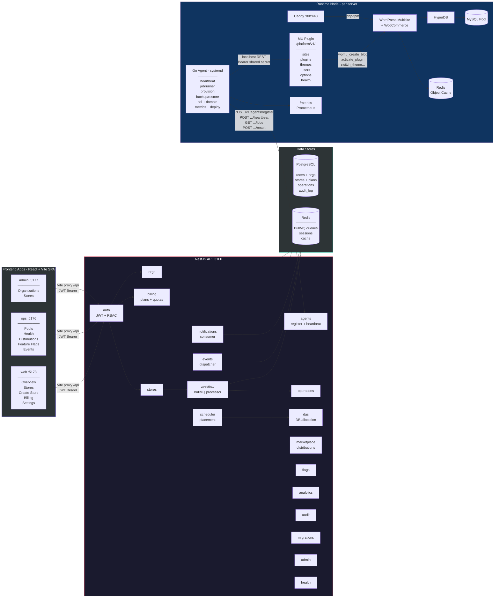
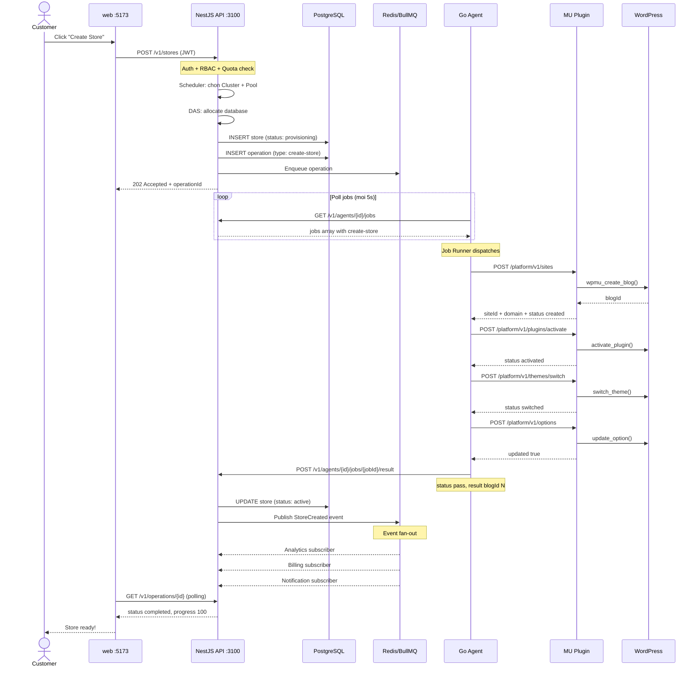
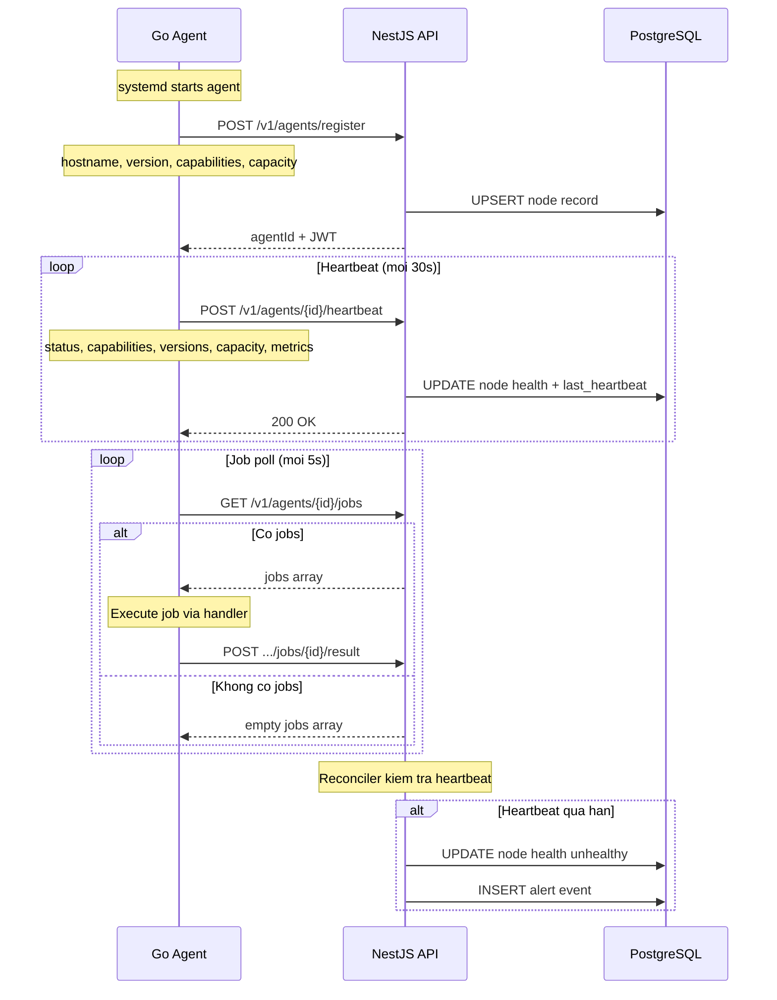
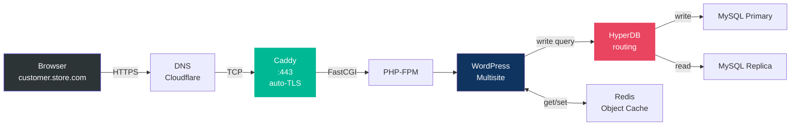
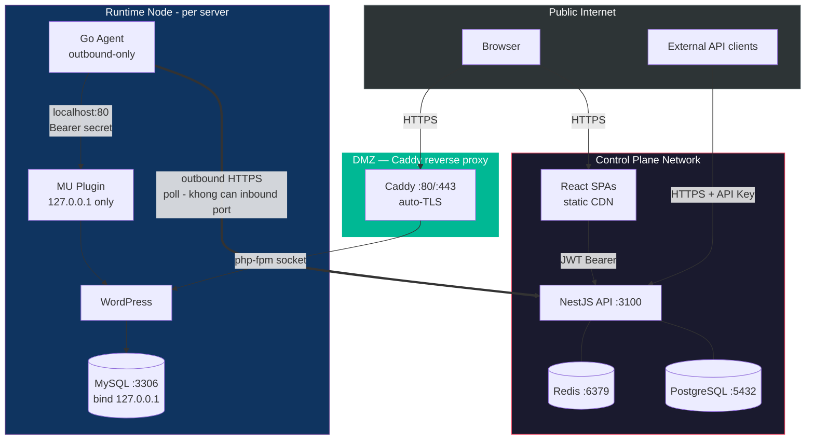
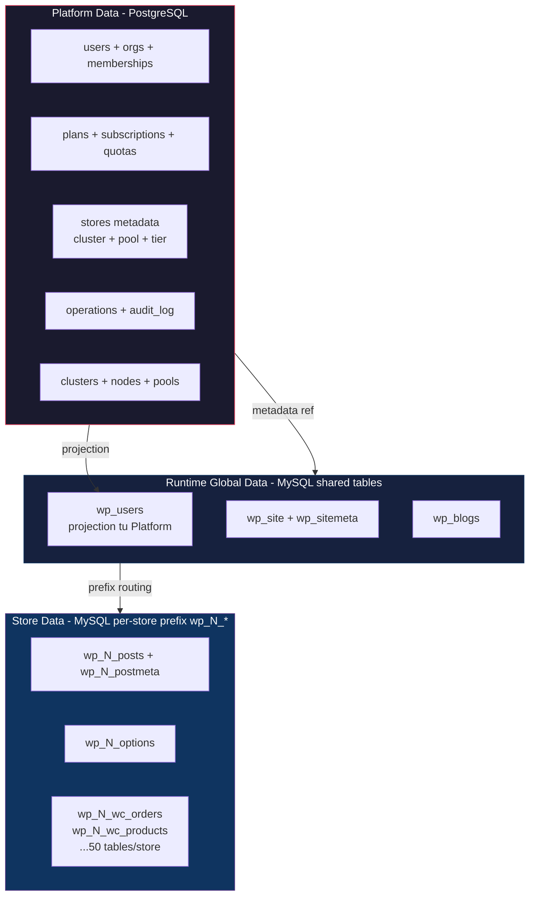

# System Architecture Diagrams — ooio

## 1. Tổng quan 3-Plane

---

## 2. Chi tiết Components và Connections

---

## 3. Luồng CreateStore - end-to-end

---

## 4. Agent Lifecycle

---

## 5. Request Flow - Customer truy cap Store

> **Luu y:** Control Plane khong nam trong duong di cua request khach hang.
> Store chay doc lap — neu Control Plane down, store van phuc vu traffic binh thuong.

---

## 6. Security Boundaries

### Nguyen tac bao mat chinh

| Nguyen tac | Co che |
|---|---|
| **Control Plane khong SSH** | Agent outbound-only, poll jobs qua HTTPS - ADR-003 |
| **Control Plane khong ghi DB WordPress** | Moi thay doi qua Agent → MU Plugin → Core API - ADR-003 |
| **MU Plugin chi localhost** | Bearer token shared secret, bind 127.0.0.1 |
| **MySQL khong public** | bind 127.0.0.1, HyperDB routing local |
| **3 app frontend tach phien** | localStorage key rieng, PlatformRoleGuard o API |
| **Agent khong chua business logic** | Chi thuc thi lenh ha tang tu Control Plane |

---

## 7. Data Ownership - AP-002

> **AP-001:** Khong JOIN vuot store. Aggregate qua event/projection.
> **AP-002:** Platform so huu user; store chi nhan projection.
